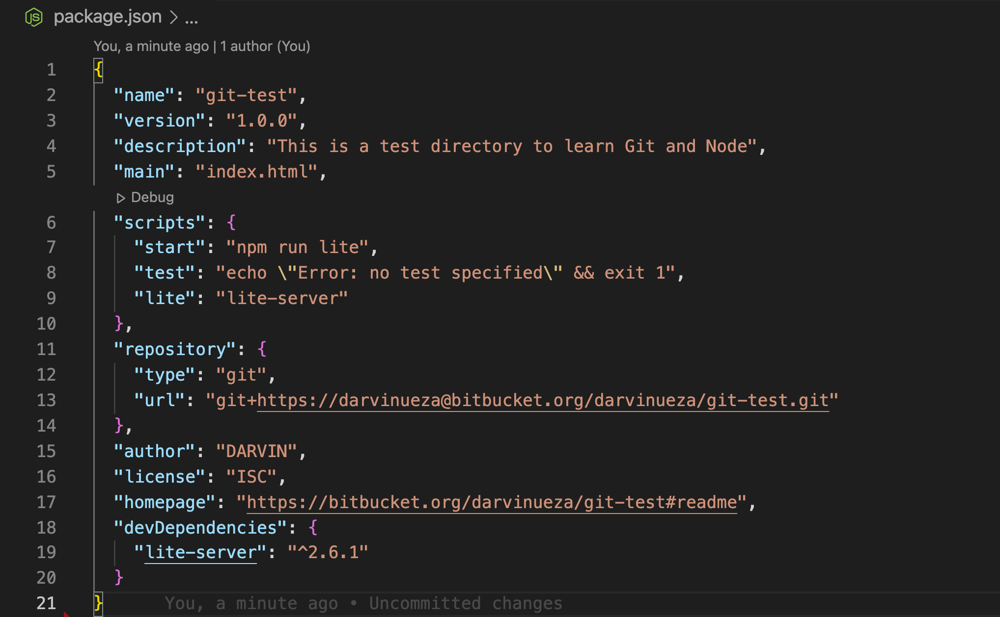

# Fundamentos de Node.js y NPM

## Objetivos y resultados

En este ejercicio aprenderás los fundamentos de Node y NPM. Al final de este ejercicio, serás capaz de

- Configurar el archivo package.json en la carpeta del proyecto para configurar tu Node y NPM para este proyecto
- Instalar un módulo NPM y hacer uso de él dentro de tu proyecto

## Inicialización de _package.json_

- En la línea de comandos de su carpeta **git-test**, escriba

      # npm init

- Siga las indicaciones y responda a las preguntas de la siguiente manera: acepte los valores por defecto para la mayoría de las entradas, excepto establecer el punto de entrada en index.html

- Esto debería crear un archivo _package.json_ en su carpeta **git-test**.

## Instalación de un módulo NPM

- Instala un módulo NPM, lite-server, que te permite ejecutar un servidor web de desarrollo basado en Node.js y servir tus archivos de proyecto. Para ello, escriba lo siguiente en el prompt:

      # npm install lite-server --save-dev

- Puede consultar más documentación sobre lite-server [aqui](https://github.com/johnpapa/lite-server).

- A continuación, abra _package.json_ en su editor y modifíquelo como se muestra a continuación. Observe la adición de dos líneas, la línea 7 y la línea 9.

  

- A continuación, inicie el servidor de desarrollo escribiendo lo siguiente en el prompt:

      # npm stat

- Esto debería abrir su página _index.html_ en su navegador por defecto.

- Si ahora abres la página _index.html_ en un editor y haces cambios y los guardas, el navegador debería actualizarse inmediatamente para reflejar los cambios.

## Configuración de .gitignore

- A continuación, cree un archivo en el directorio de su proyecto llamado _.gitignore_ (**Nota:** el nombre comienza con un punto)Luego, añada lo siguiente al archivo _.gitignore_

      node_modules

- A continuación, haga un git commit y empuje los cambios al repositorio en línea. Notarás que la carpeta node_modules no se añadirá al commit, y no se subirá al repositorio.

## **Conclusiones**

En este ejercicio has aprendido a configurar package.json, instalar un paquete npm e iniciar un servidor de desarrollo.
